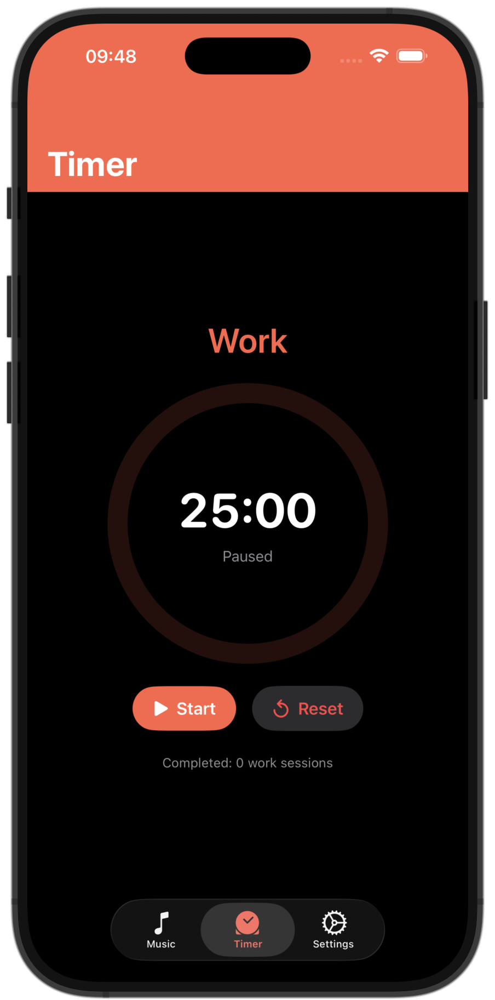
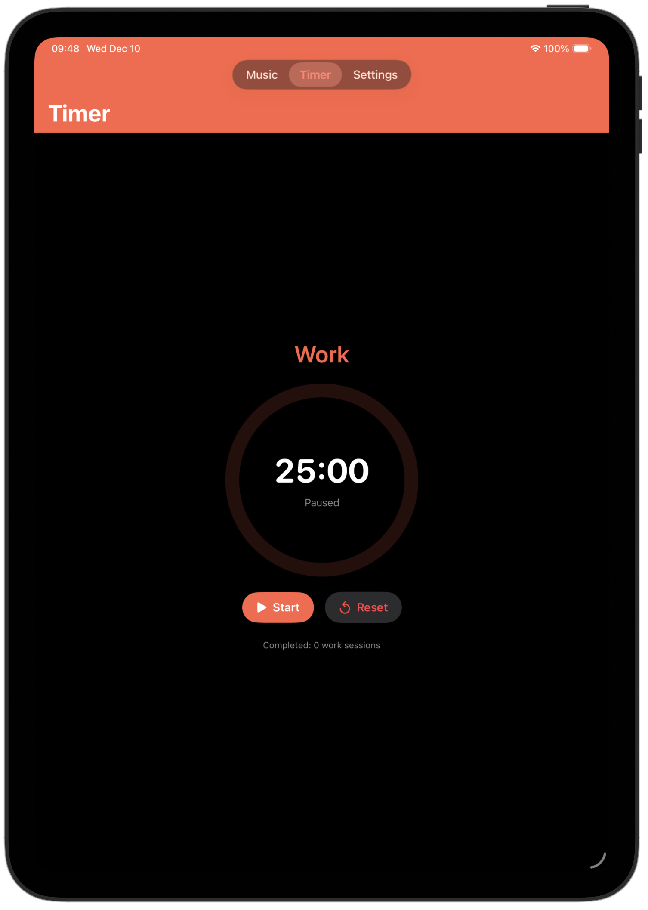
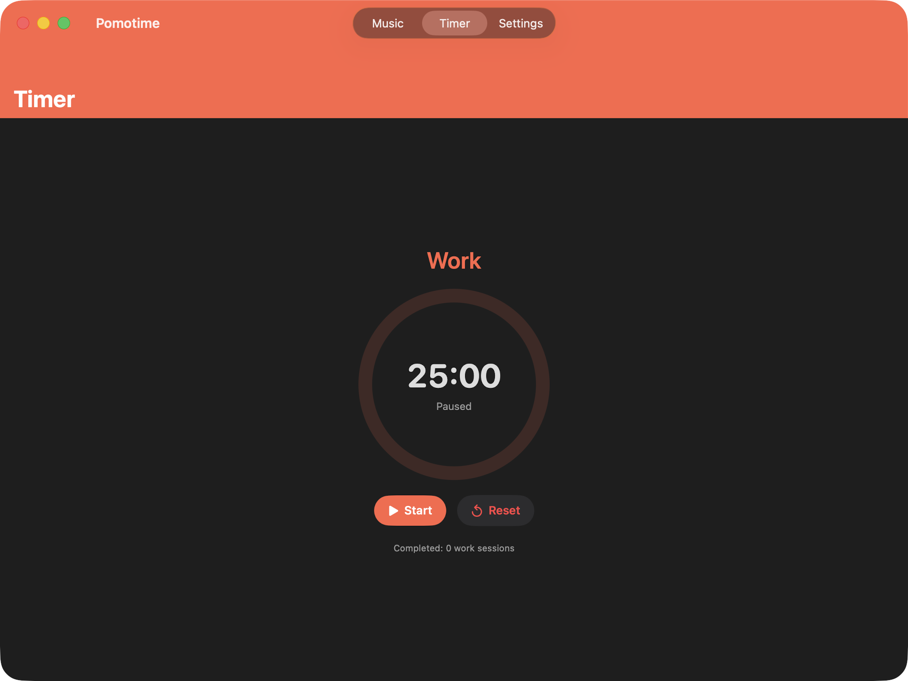
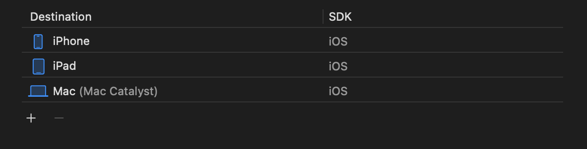

# Mac Catalyst

## Kaj je Mac Catalyst

Je tehnologija, ki razvijalcem omogoča, da obstoječo kodo iPhone/iPad aplikacije prevajajo in poganjajo na macOS-u z minimalnimi spremembami v kodi.

Za razvoj UI se na iOS/iPadOS aplikacijah uporablja ogrodje UIKit, ki pa kot tako ni primerno za uporabo na računalnikih, saj so vizualni elementi prilagojeni za interakcijo z dotikom. Catalyst v ozadju zato opravi veliko prilagoditev, ki aplikaciji dajo izgled in občutek povsem nativne aplikacije za macOS. To vključuje
- **Prevod vhoda:** Dotik preslika v klike miške, poteze sledilne ploščice in vnos s tipkovnice.
- **Prilagoditev vmesnika:** Samodejno prilagodi nekatere kontrole UIKit, da so videti kot njihovi ekvivalenti v macOS-u (npr. kontekstni meniji, integracija menijske vrstice).
- **Integracija funkcij macOS-a:** Omogoča dostop do funkcij, specifičnih za Mac, kot so menijska vrstica, bližnjice na tipkovnici in obnašanje oken

Mac Catalyst je torej tehnologija, ki omogoča razvijalcu razvoj aplikaciije za iOS in MacOS z minimalnimi spremembami kode brez popolne reimplementacije grafičnega vmesnika za posamezne platforme.

## Zakaj Mac Catalyst

Že dalj časa me je zanimal razvoj za Apple platforme, predvsem jezik Swift, ki se mi zdi da je zasnovan, da je zelo prijazen za razvojalce in je v tem trenutku lahko uporabljen za tako back end kot tudi front end aplikacij. Catalyst pa se je kot del tega razvojnega okolja izkazal še za posebej zanimivo in uporabno orodje, ki lahko razvijalcu znatno olajša delo.

S tem namenom sem se poglobil v razumevanje delovanja in uporabe tega orodja.

## Prednosti
- Hitrejši razvoj za več platform
- Enotna kodna baza za vse platforme, posledično lažje vzdrževanje

## Slabosti
- Ni popolnoma "Mac-native" občutek
- Potrebne dodatne optimizacije za delo z velikimi zasloni
- Manj prilagodljivo kot aplikacija napisana v ogrodju za MacOS.


## Licenca

Mac Catalyst je del [Apple Developer Program License Agreement](https://developer.apple.com/support/terms/apple-developer-program-license-agreement/), je closed source, del Apple-ovega razvojnega okolja Xcode


## Število uporabnikov

V letu 2025 je Mac Catalyst [uporabljala skoraj četrtina](https://rentamac.io/ios-app-development-statistics/) pri Applu registriranih razvijalcev.

## Časovna in prostorska zahtevnost

Časovna zahtevnost izvajanja programske logike Mac Catalyst aplikacije se bistveno ne razlikuje od tiste, ki je bila v celoti napisana z AppKit ogrodjem za Mac. Njeno dejansko hitrost izvajanja določa predvsem zmogljivost strojne opreme.

Prostorska zahtevnost je za Catalyst aplikacije običajno nekoliko višja kot pri AppKit aplikacijah. To je posledica dodatnih ogrodij UIKit, ki jih mora Catalyst aplikacija poleg za Mac potrebnih komponent naložiti in izvajati.

## Primeri uporabe
Mac Catalyst je odlična izbira, ko imamo že dodelano aplikacijo za iOS in bi jo z minimalnimi spremembami radi predelali za MacOS.

Tako sem tudi jaz svojo mobilno aplikacijo Pomotime s Catalys-om prilagodil za delovanje na računalniku.

|   |   |   |
|---|---|---|


## Primeri kode

Mac Catalyst se lahko doda preko nastavitev projekta kot nova destinacija za deployment.



Vidimo da čeprav je aplkacija grajena za MacOS, Catalyst uporablja SDK namenjen razvoju na iOS.

Ker je pogosto uporabniški vmesknik ali druge funkcionslnosti aplikacije vseeno potrebno prilagoditi lahko za to uporabimo direktive prevajalnika, npr. `#if targetEnvironment(macCatalyst)`

Primer v kodi:

```swift
#if targetEnvironment(macCatalyst)
    
    private let baseSize: CGFloat = 300
    
    private let basePadding: CGFloat = 18
    
    private func sizeMultiplier(for height: CGFloat) -> CGFloat {
       
        
         if height < 850 {
             return 1
         }
        
        if height < 1000 {
            return 1.25
        }
        
        if height < 1200 {
            return 1.5
        }
        
        return 2
    }
    
  	#endif
  
 	#if !targetEnvironment(iOS)

    private let baseSize: CGFloat = 300
    
    private let basePadding: CGFloat = 18
    
    private func sizeMultiplier(for width: CGFloat) -> CGFloat {
       
        
         if width < 380 {
             return 0.6
         }
        
        if width < 400 {
            return 0.75
        }
        
        if width < 440 {
            return 1
        }
        
        if width < 500 {
            return 1.1
        }
        
        return 2
    }
       
 	#endif 

```
